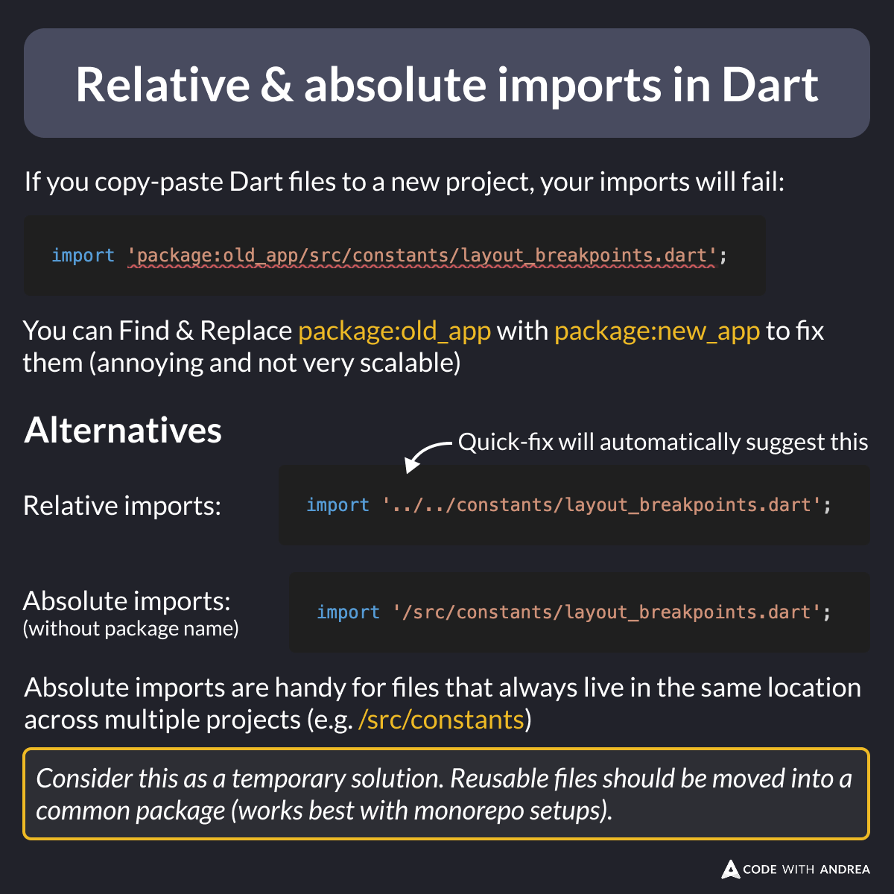

# Relative & Absolute Imports in Dart

Did you know?

You can use absolute imports for reusable Dart files that are copy-pasted across projects.

This way, they are always imported correctly (as long as they live in the same location relative to the project root).

<!--
If you copy-paste Dart files to a new project, your imports will fail:
import 'package:old_app/src/constants/layout_breakpoints.dart';

You can Find & Replace package:old_app with package:new_app to fix them (annoying and not very scalable)

Alternatives

Relative imports:

import '../../constants/layout_breakpoints.dart';

Absolute imports:

import '/src/constants/layout_breakpoints.dart';

Absolute imports are handy for files that always live in the same location across multiple projects (e.g. /src/constants)

Consider this as a temporary solution. Reusable files should be moved into a common package (works best with monorepo setups).

-->

---

| Previous | Next |
| -------- | ---- |
| [Deprecated APIs in Matrix4](../0255-matrix4-vector3/index.md) | |

<!-- TWITTER|https://x.com/biz84/status/1970424616339333506 -->
<!-- LINKEDIN|https://www.linkedin.com/posts/andreabizzotto_did-you-know-you-can-use-absolute-imports-activity-7376190465567797248-WMcz -->
<!-- BLUESKY|https://bsky.app/profile/codewithandrea.com/post/3lzineac3hc2b -->

